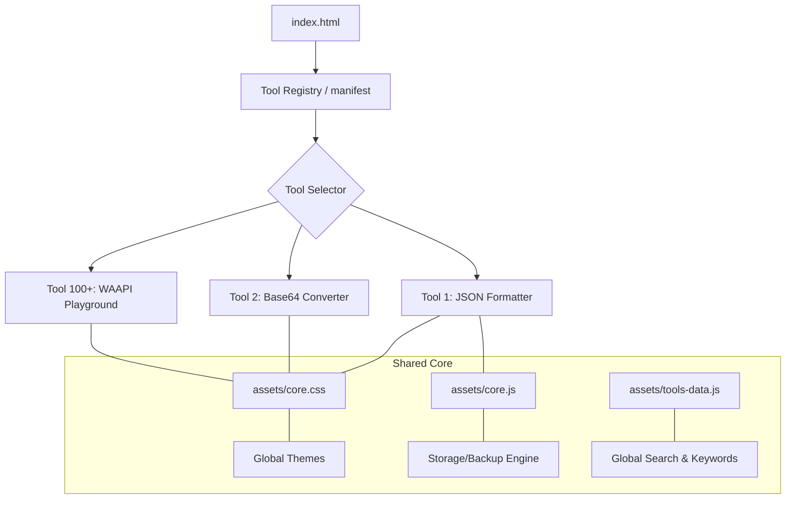

# 🛠️ AidKit: The Ultimate Developer Toolbox

[](https://opensource.org/licenses/MIT)
[](#-the-107-tool-registry)
[]()
[]()

**AidKit** is a professional-grade, offline-first suite of **107 developer utilities** designed to eliminate context-switching and dependency on external web-based formatters. Built with a focus on privacy and performance, every tool runs entirely in your browser—no backend, no tracking, and no data leaves your machine.

[**🌐 Launch Web App**](https://aliriyaj007.github.io/AidKit/) | [**📥 Direct Download**](https://github.com/Aliriyaj007/AidKit/archive/refs/heads/main.zip)

---

## 🎯 Why This Tool Exists

Modern development requires constant data transformation, debugging, and visualization. Relying on dozens of fragmented, ad-heavy websites for JSON formatting, JWT decoding, or Regex testing isn't just inefficient—it's a security risk.

**AidKit solves this by providing:**
- **Zero Latency:** Everything is pre-loaded and runs client-side.
- **Privacy First:** Data never touches a server. Perfect for sensitive logs or API keys.
- **Total Consistency:** A unified "Neon" design system across all 107 tools.
- **Visual Feedback:** Interactive 3D visualizations (Three.js) for every utility to help conceptualize complex data.

---

## 🔄 The Before & After

| Feature | Conventional Workflow | The AidKit Way |
| :--- | :--- | :--- |
| **JSON Formatting** | Search Google → Dodge Ads → Paste Data → Risk Leak | Ctrl+L → "JSON" → Instant Format (Local) |
| **JWT Debugging** | Use online sites → Risk sharing signatures | Local decoding with 3D structural mapping |
| **Regex Testing** | Multiple tabs for explanation vs testing | Integrated visual builder + path analysis |
| **Connectivity** | Requires stable internet | Works 100% offline (PWA-ready) |

---

## 🏗️ Architecture Overview

AidKit is built on a "Zero-Build" architecture, ensuring maximum longevity and ease of deployment.



---

## ⚡ Quick Start (Under 60 Seconds)

### Method 1: Use Web Version (Recommended)
Simply visit [**https://aliriyaj007.github.io/AidKit/**](https://aliriyaj007.github.io/AidKit/) and start typing in the search box to find your tool.

### Method 2: Local Deployment
1. **Clone the repo:**
   ```bash
   git clone https://github.com/Aliriyaj007/AidKit.git
   ```
2. **Open index.html:**
   Simply double-click `index.html` in your file explorer. No `npm install` or local server required.

---

## 🎨 Premium Features

### 🌈 Five Global Themes
Switch dynamically between:
- **Neon Glow** (Default: High-energy cyberpunk)
- **Deep Dark** (OLED optimized)
- **Solarized** (Professional eye-care)
- **Light Mode** (Crisp print-friendly)
- **High Contrast** (Accessibility focused)

### 💾 Persistence & Backup
Save your favorites and custom tags locally. Use the **Backup/Restore** feature to sync your preferences across different browsers or machines via a simple JSON manifest.

---

## 📋 The 107-Tool Registry

Below is a partial list of the specialized categories available:

| Category | Tools Included |
| :--- | :--- |
| **Data & Encoding** | JSON/YAML/XML, Base64, URL, JWT, Protobuf, CSV |
| **Encryption/Security** | RSA, Hash (MD5/SHA), SSL Decoder, CORS Debugger |
| **Frontend/Design** | CSS Grid, Flexbox, Variable Organizer, Type Scale |
| **DevOps/Git** | .gitignore builder, Docker Linter, Git Hook Builder |
| **Performance** | Bundle/WASM Analyzer, Lighthouse CI, Memory Leak Simulator |

*Full tool specifications can be found in [app_details.md](app_details.md).*

---

## 🤝 Contributing & Feedback

AidKit is a community-first project. Whether it's adding a new 3D visualization or optimizing a parser, contributions are welcome.

1. Fork the project.
2. Add your tool (use the template in `tool-107-...html`).
3. Update `assets/tools-data.js`.
4. Open a Pull Request.

---

## 👤 Author & Contact

**Riyajul Ali**  
*Full Stack Developer & Technical Architect*

- **GitHub:** [Aliriyaj007](https://github.com/Aliriyaj007)
- **Email:** aliriyaj007@protonmail.com
- **LinkedIn:** [in/Aliriyaj007](https://linkedin.com/in/Aliriyaj007)
- **Project Link:** [https://aliriyaj007.github.io/AidKit/](https://aliriyaj007.github.io/AidKit/)

---

*“This project proves its value by existing.” — Code with precision.*
